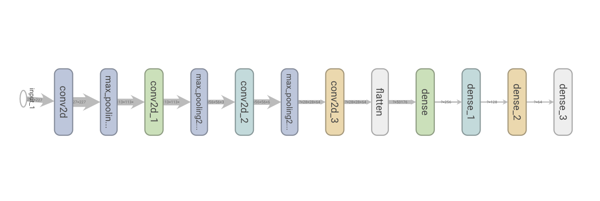

# Projet application - Traitement de vidéos

 

_Auteurs:_ [Simon Audrix](mailto:saudrix@ensc.fr) & [Gabriel Nativel-Fontaine](mailto:gnativ910e@ensc.fr)

Ce dépôt contient notre travail dans le cadre du module **Projets applicatifs - Vidéo** du parcours **Intelligence Artificielle** inscrit dans la 3ème année du cursus d'ingénieur au sein de l'[Ecole Nationale Supérieure de Cognitique](http://www.ensc.fr).

## Changelog

### [08.12.2020 au 15.12.2020]

* Modèle de classification d'images (Partie 1)

### [15.12.2020 au 05.01.2021]

- Ajout de l'enregistrement automatique du modèle durant l'entrainement

- Ajout d'une visualisation des images les plus mal prédites (prédite dans la mauvaise classe avec une probabilité élevée)

- Tracking vidéo

- Move-To-Data

- Fine-tuning

### [05.01.2021 au 22.01.2021]

- Correction de l'algorithme d'Intersection Over Union
- Mise à jour du modèle initial qui présente de meilleurs résultats, nous avons intégré les éléments de preprocessing des images directement dans le modèle Keras
- Nettoyage du code
- Ajout de comparaisons avec les modèles fournis
- Ajout de comparaisons avec les tracker OpenCV

## Partie 1: Classification d'images

Dans un premier temps, il nous a été demandé de classifier des images à l'aide d'un réseau de neurones.

Ces images sont des images de tailles 227 par 227 en couleurs, représentant des objets du quotidien pouvant apparaître dans une cuisine. Les images sont des images rognées pour ne contenir que l'objet que l'on souhaite classifier, réalisées à partir du jeu de données _Grasping In The Wild (GITW)_.

Dans cette première partie, on compte 5 classes:

- Bol
- Paquet de sucre
- Canette de Coca Cola
- Bouteille de lait
- Paquet de riz

   
   
   
   
   

### Pré-traitement des données

Comme avant tout traitement et analyse sur des données, il est nécessaire d'appliquer un prétraitement garantissant le même résultat pour toutes les images, améliorant ainsi la généralisation à des images n'appartenant pas au jeu de données initial (changements d'endroits, de luminosité, ...).

Le jeu de données contient 4736 images pour le set d'entrainement et 3568 images pour le set de test. C'est peu par rapport à ce que l'on sait des réseaux neurones. Il peut donc être nécessaire de faire de l'augmentation sur notre jeu de données, en appliquant des traitement comme des rotations des miroirs, ... on peut entrainer notre réseau sur plus d'images tout en améliorant encore ses performances de généralisation.

### Réseau custom

Le code de ce réseau est disponible dans un jupyter notebook:  [notebooks/nn_custom.ipynb](https://github.com/3a-ia-ensc/Video/blob/main/notebooks/nn_custom.ipynb).

Nous avons commencé par créer un réseau _"from scratch"_ , un simple réseau de convolutions. 

   

#### Résultats

   

Notre réseau présente d'assez bonnes performances, nous obtenons **91%** d'accuracy sur le set de test. Nous obtenons également une précision de **91%**, ce qui indique un taux de faux positifs de 9% seulement. On obtient également un score de rappel de **90%**. Le rappel donne le taux d'observations correctement étiquettées. On observe donc que seul 10% des prédictions sont mal étiquettées.

### Réseaux pré-entraînés

Le code de ce réseau est disponible dans un jupyter notebook:  [notebooks/nn_vgg.ipynb](https://github.com/3a-ia-ensc/Video/blob/main/notebooks/nn_vgg.ipynb).

Nous avons comparé les résultats obtenus avec un réseau créé à partir d'un réseau déjà existant, ainsi nous avons utilisé l'architecture du réseau VGG pré-entraîné sur la base de données ImageNet.

   

#### Résultats

##### Métriques

   

Nous obtenons des résultats sensiblements identiques sur ce réseau mais pour un temps d'entrainement près de 10 fois supérieur. En effet, l'entrainement de ce réseau à pris un peu de plus de 7h.

Nous obtenons **88%** d'accuracy sur le set de test. Nous obtenons également une précision de **90%**, ce qui indique un taux de faux positifs de 10% seulement. On obtient également un score de rappel de **87%**.

##### Analyse des mauvaises prédictions

Il peut être intéressant d'afficher les images du jeu de set qui ont été mal prédites avec un pourcentage élevé. Ici, on affiche 25 images dont le pourcentage de prédiction est supérieur à 90%.

   

On observe les situations suivantes:

- lorsque l'objet est perçu dans un angle moins souvent représenté dans la base de données, il est mal reconnu (c'est le cas pour la canette de coca vue de dessus et le bol vue de côté)
- lorsque deux objets de classes différentes sont sur l'image, la reconnaissance peut préférer le "mauvaise objet" (c'est le cas pour le sucre et le lait des premières images)
- lorsque un sachet ne présente plus les même proportions il est également mal reconnu (c'est le cas pour le sachet de riz partiellement vide)

## Partie 2: Apprentissage incrémental

Le code développé dans cette partie du projet est visible dans un jupyter notebook:  [notebooks/tracking_video.ipynb](https://github.com/3a-ia-ensc/Video/blob/main/notebooks/tracking_video.ipynb).

### Tracking vidéo

En partant d'une première détection de l'objet d'intérêt qui prend la forme d'une boite englobante que l'on suppose correcte, on va suivre l'objet sur les frames suivantes.

Pour chaque frame, on prend la boîte englobante de la frame précédente, on va créer un set de nouvelles boîtes potentielles. On va ensuite récupérer le "patch" de l'image associé à chaque nouvelle boîte englobante et effectuer une prediction à l'aide du modèle précédemment créé. On conservera comme nouvelle boîte celle qui fournira la prédiction la plus précise (pourcentage le plus élevé).

#### Création des boîtes potentielles

Pour créer des boîtes potentielles, en partant de la boîte d'origine (celle de la frame précédente), on créé de nouvelles bôites résultants de plusieurs translations de quelques pixels dans toutes les directions (ceci permet de suivre l'objet en mouvement). Afin de pouvoir suivre un objet qui s'approche ou s'éloigne, pour chacune des translations, nous créons également des boîtes zoomé selon différents facteurs.

Nous avons lancé le tracking vidéo sur toutes les vidéos de test, voici quelque examples de tracking.

Visuellement, obtient de bons résultats, la boîte englobante prédite semble suivre l'objet que l'on "track". De manière générale, notre réseau semble capable de reconnaitre l'objet à partir de morceaux de l'objet uniquement, on observe donc souvent un rétrecissement de nos boîtes englobantes comme on le voit sur le premier GIF.

Ce rétrécissement explique les valeurs d'intersection sur l'union (**IoU**) assez faible (en moyenne, 0.05) que l'on obtient avec notre tracker. En effet, la boîte créée ne représentant qu'une petite partie de la "vraie" boîte, l'IoU calculée est faible.

   
   
  

### Move-to-data

Nous avons implémenté la méthode d'apprentissage incrémental "move-to-data" décrite dans _Move-to-Data: A new Continual Learning approach with Deep CNNs, Application for image-class recognition_.

Pour chaque nouvelle image, on met à jour les poids de la dernière couche du réseau en appliquant la formule suivante 
$$
w_j′=w_j+(||w_j||∗\frac{v_i}{||v_i||} − w_j)*\epsilon
$$
Après entrainement sur les images issues de notre tracking vidéo, notre modèle présente de légère améliorations de performances sur le set de test.

Initialement, on le modèle présentait les valeur suivantes:

- loss = 0.085640

- accuracy = 0.9703
- Rappel = 0.9680
- Precision = 0.9713

Après 5 epochs de move-to-data sur les nouvelles images, le modèle présente les performances suivantes (en quelques secondes)

- loss = 0.085636

- accuracy = 0.9722
- Rappel = 0.9714
- Precision = 0.9757

On note donc une légère amélioration des performances.

### Fine tuning

Nous avons également implémenté la technique du fine-tuning pour comparer les résultats de la technique move-to-data. Dans un premier temps, on s'aperçoit que la méthode d'entrainement est bien plus longue.

Après 5 épochs de fine-tuning, nous obtenons les performances suivantes:

- loss = 0.5759

- accuracy = 0.8267
- Rappel = 0.8071
- Precision = 0.8453

Dans ce cas, on observe une nette diminution des performances. Ceci pourrait s'expliquer par une différence dans la "vitesse" des modifications faites aux poids (learning rate).

### Comparaisons

Nous avons comparé notre méthode de tracking avec d'autres modèles ainsi qu'avec d'autre trackers. Cette comparaison s'est faite sur la base de la valeur d'**IoU** (Intersection Over Union) moyenne sur une vidéo.

#### Models fournis

Nous avons tester de remplacer notre modèle par deux modèles fournis.

#### Tracker OpenCV

Sans grande surprise, les trackers fournis par OpenCV donnent d'assez bonnes performances, le meilleur des trois que nous avons testé donne une IoU moyenne d'environ **0.45** sur la vidéo de test et le moins de **0.25**.

## Conclusion

Nous avons terminés la majorité des tâches demandées. Dans cette partie, nous proposons des pistes d'amélioration que nous pourions mettre en place dans le futur afin d'améliorer les performances de notre tracking.

### Taille des boites

L'un des principaux problèmes de notre algorithme est le cadrage des boites. En effet, la taile d'une boite de tracking n'est pas limité, les cadre crées par notre codes on donc tendances à se réduire des fois à un point unique. L'objectif de suivre l'objet est donc accompli, cependant celui d'obtenir une boite englobante est quelque peu atteint par ce mécanisme.

Des solutions qui pourrait permettre une amélioration de ce fonctionnement serait les suivante:

- Limiter la taille des boites: Cela ce discute, mais une taille minimale (et maximale) pourrait être imposé au boite afin de prévenir leur rétrecissement.
- Render le changement de taille dépendant de la boite englobante précédante: On pourrait choisi de modifier moins fortement une petit boite qu'une grande ce qui pourrait avoir comme impact de limiter le retrécissement des boite crées par notre algorithme.

### Perte du suivi

Dans le cas ou un objet suivi serait perdu par un mouvement trop important dans la vidéo, ou en sortant de l'écran il est actuellement impossible avec l'algorithme actuel de reprendre le suivi lorsque ce dernier réapparétrait sur l'image. En effet notre technique est itérative, et chaque boite s'appuie sur l précédente. Si l'on perd l'objet l'algorithme va continuer à créer des boites non pertinente qui ont peut de chance de recapturer l'objet au moment de sa réapparition dans la vidéo.

Une technique à mettre en place pourrait être la suivante:

 - Detecter la perte d'un objet:

En établissant un seuil minimal, il serait possible d'évaluer si l'objet est présent ou non dans une boite prédite par le réseaux on pourrait supposer que si le réseaux présente une reconnaissance faible (.1 de sureté par exemple) alors on peut supposer que l'on à perdu le suivi ou que l'objet n'est plus présent sur la vidéo.

 - Passer en mode recherche:
 
 On activerait alors un mode de recherche, au lieu de créer des boites dépendantes des précédantes, on pourrait créer un répartition sur l'image entière en la découpant en rectangle recouvrant toutes l'image. Ces rectangles serait alors passés à notre réseaux.
 
 - Reprendre le tracking:
 
 On pourrait alors repasser dans le mode tracking, en mettant un seuil de reconnaissance, à partir du quel on suppose que notre objet est réapparut dans l'un des rectangle de l'image découpe. Ce rectangle constiturai alors notre nouvelle box de départ et l'algorithme pourrait reprendre le tracking de manière itérative.
